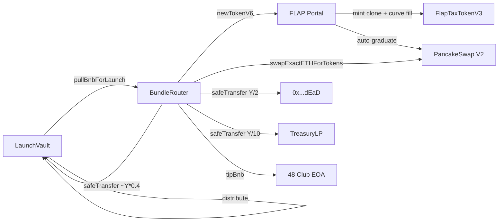

the bundle is the single transaction that turns a filled vault into a live
token with PCS liquidity and pro-rata distribution. understanding what it
does is the difference between trusting the platform and trusting a slogan.

## the contracts involved

## what happens inside executeBundle, in order

1. **set executed = true.** the router is one-shot. this flag flips before any
   third-party call to block reentry from a malicious token transfer hook.
2. **pull BNB from the vault.** the router calls
   `vault.pullBnbForLaunch(quoteAmt + v2BuyBnb + tipBnb)`. the vault transitions
   `OPEN/CLOSED` to `LAUNCHED` here, so even if downstream steps revert, the
   state is consistent.

   <Note>
     a revert inside `executeBundle` rolls back the LAUNCHED transition. that
     is the whole point of atomicity. the vault state only "really" advances
     when the outer transaction commits.
   </Note>
3. **mint the token.** call `FlapPortal.newTokenV6{value: quoteAmt}(params)`.
   the portal deploys a `FlapTaxTokenV3` clone, fills the bonding curve, and
   if the curve crosses the four-fifths threshold (graduating tiers), auto-creates
   a PCS v2 pair seeded with 200M tokens and the curve BNB.
4. **validate predicted token.** the router checks the returned token address
   matches the `predictedToken` it stored at construction (CREATE2 with the
   creator's vanity salt). this guards against portal bugs.
5. **follow-up buy (if v2BuyBnb > 0).** call
   `pcsRouter.swapExactETHForTokensSupportingFeeOnTransferTokens` with
   `minV2TokensOut` as slippage guard. this puts tokens into the router (post-tax
   because FLAP tokens are fee-on-transfer).
6. **split the token balance.** the router reads
   `IERC20(token).balanceOf(this)`. it then computes:
   - `burn = Y / 2`
   - `treasury = Y / 10`
   - `vault = Y - burn - treasury` (rounding remainder goes to vault)
7. **distribute the splits.** `safeTransfer` the burn share to `0x...dEaD`,
   the treasury share to `TreasuryLP`, the vault share to `LaunchVault`. then
   call `vault.distribute(token, vaultAmt)` so claims can compute pro-rata.
8. **tip the builder.** raw call to the 48 club EOA with `tipBnb`. this pays
   for inclusion in the puissant private mempool.
9. **dust sweep.** any leftover BNB at the router goes to `0x...dEaD`. the
   router never holds custody between transactions.

## what is atomic

every step above is in a single transaction. if any one reverts, the entire
transaction reverts, and:

- vault BNB is preserved (no transfer ever cleared)
- no token was minted (or the mint was rolled back at the EVM level)
- no PCS pair exists (or the pair creation was rolled back)
- no presaler share was distributed
- the router's `executed` flag is rolled back to `false`, so the bot can retry

## what is not atomic

a few things are operationally trusted, not enforced on-chain:

- **the bundle bot must actually call executeBundle.** if the bot is down, the
  launch sits in `CLOSED` state. after three retries the bot calls
  `enableRefundBundleFailed()` and presalers refund. the bot is not the
  custodian, it is the operator.
- **the FLAP portal is third-party.** the contract validates the returned token
  address (predictedToken check) and relies on FLAP's own state. if FLAP is
  compromised at the protocol level, the bundle can fail or behave unexpectedly,
  but BNB inside our vault is still recoverable through refund.
- **PCS v2 prices.** the `minV2TokensOut` slippage guard prevents catastrophic
  sandwich loss, but ordinary slippage within tolerance is accepted.

## the token split, in numbers

the dynamic split reads from `balanceOf` after the v2 buy, so exact numbers
vary with fee-on-transfer rates and PCS slippage. for a tier 90 launch with
default 3% buy tax:

- portal sends router ~12 BNB worth of post-tax tokens from the v2 buy
- ~50% of that gets burned
- ~10% goes to TreasuryLP
- ~40% goes to LaunchVault for presaler claims

the actual numbers are emitted in the `BundleExecuted` event so you can verify.

## the predicted token check

each launch computes a CREATE2 address up front using the creator's vanity
salt and the FLAP TOKEN_TAXED_V3 implementation. the router stores this as
an immutable. if FLAP returns a different address from `newTokenV6`, the
bundle reverts. this is the strongest defense we have against portal misbehavior.

## why one-shot

`BundleRouter.executed` flips from `false` to `true` permanently at the start
of `executeBundle`. there is no path to flip it back. this means:

- a successful bundle cannot be replayed
- a malicious token transfer hook trying to reenter lands on `AlreadyExecuted`
- the router is a single-use contract by design
