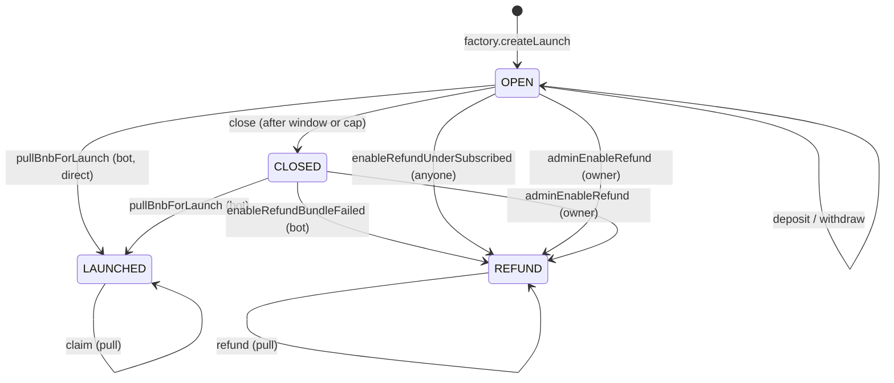

every launch has one vault. one set of states. one set of transitions. once
you understand the state machine, you understand presale on waifu.fun.

## the state machine



four states. once a vault hits `LAUNCHED` or `REFUND` it never leaves. these
are terminal.

## OPEN

the vault is accepting deposits. anyone with BNB can call `deposit()`. the
deposit is tracked per-address:

```solidity
struct Depositor {
    uint256 deposited;  // BNB principal
    uint256 claimed;    // tokens already claimed
}
```

while in OPEN, you can also `withdraw()` your deposit back. this is a clean
exit, no fees, no penalty. once the vault transitions out of OPEN, withdraw
is no longer available, but refund is (if you reach `REFUND` state).

deposits are rejected if:

- the vault is not in OPEN state
- adding your deposit would exceed `presaleCap` for the tier
- the close window has passed (`block.timestamp >= closeTimestamp`)

## the close transition

`close()` is permissionless. anyone can call it. it requires either:

- `totalDeposited >= presaleCap` (the cap was hit), or
- `block.timestamp >= closeTimestamp` (the window has passed)

`close()` snapshots the deposit total into `totalDepositedAtLaunch` and emits
the `Closed` event. the vault is now in `CLOSED`.

<Note>
the bundle bot can skip `close()` and call `pullBnbForLaunch` directly from
OPEN if the cap is hit. this is legal but unusual. the math handles both
paths with the same correctness guarantees.
</Note>

## CLOSED

the bundle bot is processing this launch. it has the vault in its queue. it
will call `executeBundle()` on the router, which calls
`vault.pullBnbForLaunch()` first.

at this point you cannot:

- deposit more
- withdraw
- claim (no token has been distributed yet)
- refund (unless the bundle fails, see below)

just wait. typical CLOSED-to-LAUNCHED time is one block. the bot retries up
to three times if the first attempt reverts.

## LAUNCHED

the bundle ran. the vault has tokens. `vault.distribute(token, vaultAmt)`
was called inside the bundle, so:

- `vault.token` is set to the FlapTaxTokenV3 address
- `vault.presalerShare` is the total tokens allocated to all presalers
- `vault.launchTimestamp` is the block timestamp of execution

now you call `claim()` to pull your pro-rata share. see
[vesting explained](/presalers/vesting-explained) for the unlock schedule.

## REFUND

the vault has reached refund state through one of three paths:

1. **under-subscribed.** the close window passed without the cap being met.
   anyone can call `enableRefundUnderSubscribed()`.
2. **bundle failed.** after three failed bundle attempts, the bot calls
   `enableRefundBundleFailed()`.
3. **admin emergency stop.** the platform owner calls `adminEnableRefund(reason)`
   with a human-readable reason string. this is the kill switch. it only
   works if the vault is not yet `LAUNCHED`.

in REFUND state, every depositor calls `refund()` independently to get their
BNB back plus a pro-rata bonus from the bonus pool.

## bonus pool

if your launch was undersubscribed and there was a bonus pool stake, the
bonus is paid out proportional to your principal share. the math:

```
bonus_i = principal_i == totalDeposited
  ? bonusPool
  : (bonusPool * principal_i) / totalDeposited
```

if the bonus pool is zero (which is the default for normal launches), this
is just principal. the bonus pool is an optional feature funded out-of-band.

## what you can call, by state

| state | deposit | withdraw | close | claim | refund |
| --- | --- | --- | --- | --- | --- |
| OPEN | yes | yes | yes (if cap hit or window expired) | no | no |
| CLOSED | no | no | no | no | no |
| LAUNCHED | no | no | no | yes | no |
| REFUND | no | no | no | no | yes |

## events you should care about

- `Deposited(user, amount, newTotal)` your deposit landed
- `Withdrew(user, amount, newTotal)` you backed out before close
- `Closed(by, totalDeposited, bonusPool)` the vault is in CLOSED
- `LaunchExecuted(0, amount, timestamp)` the router pulled BNB, vault is in LAUNCHED
- `Distributed(token, vaultAmt)` tokens are in the vault and ready to claim
- `Claimed(user, amount, totalClaimed)` you pulled a claim
- `RefundEnabled(by, reason)` the vault is in REFUND
- `Refunded(user, principal, bonus, total)` you pulled a refund
