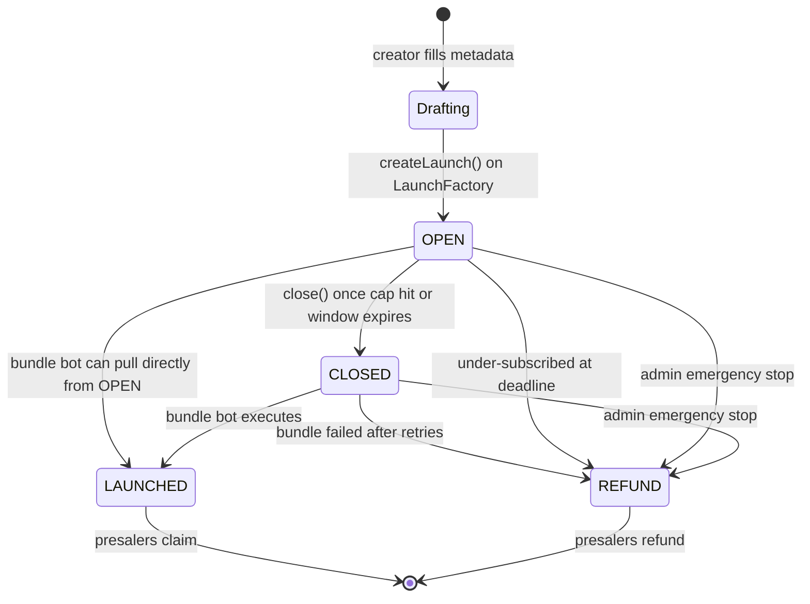

a launch on waifu.fun is a per-token deployment with its own escrow, atomic
executor, treasury, tax splitter, and agent multisig. one creator, one token,
one set of contracts. when the bundle finishes, the router locks itself, the
vault distributes tokens to claimers, the treasury starts deploying its V3
LP ladder as price rises, the tax splitter forwards the FLAP fee stream
3-way, and the agent's Safe collects its share.

## the lifecycle

four user-visible states on the vault:

- **OPEN.** depositors can put BNB in. they can withdraw any time before close.
- **CLOSED.** deposits are frozen. the bundle bot is about to execute.
- **LAUNCHED.** the bundle ran successfully. tokens are in the vault. presalers
  can claim.
- **REFUND.** the launch failed or expired. presalers can refund their BNB
  plus their pro-rata bonus share.

## the actors

- **the creator** signs in with SIWE, picks a tier, writes metadata, pays the
  creation fee. they do not get tokens at TGE.
- **the depositor (presaler)** deposits BNB during the OPEN window. they get
  tokens (LAUNCHED) or their BNB back plus bonus (REFUND).
- **the bundle bot** is an EOA the platform runs. it watches for launches that
  hit cap or window deadline, builds the bundle params, and calls
  `executeBundle()` through a private mempool (puissant).
- **the FLAP portal** is an third-party contract on BSC. it mints the token,
  fills the bonding curve, and auto-graduates to PCS v2 once the curve crosses
  the four-fifths threshold.
- **the platform owner** can transfer ownership and trigger admin-refund on a
  vault. cannot mint tokens. cannot drain BNB. cannot change tier math.

## one transaction, atomic

the heart of the system is `BundleRouter.executeBundle()`. inside that one
transaction:

1. pull BNB from the vault (`quoteAmt + v2BuyBnb + tipBnb`)
2. call `FlapPortal.newTokenV6(...)` with `quoteAmt`, which mints the token
   and seeds the bonding curve
3. if the curve graduates (BASED or higher), PCS v2 pair gets created automatically
4. if `v2BuyBnb > 0`, follow-up buy from the PCS pair (post-tax)
5. compute flat token splits against `totalSupply()`: vault gets 200M
   (20% of supply), treasury gets 100M (10% of supply), burn gets the
   remainder (50% of supply for tier 80; more for graduating tiers since
   the V2 follow-up buy adds tokens to the router balance which all flow
   into burn)
6. call `vault.distribute(token, share)` so claims can compute pro-rata
7. tip the 48 club builder EOA for inclusion
8. sweep any BNB dust to burn

if any step reverts, the entire transaction reverts and the vault is untouched.
the bundle bot can retry up to three times. after three failures the bot calls
`vault.enableRefundBundleFailed()` and all presalers can refund.

## what is "atomic"

atomic means "either all the steps happen or none of them do." it does not
mean "fast." the bundle is one transaction submitted through puissant to the
48 club builder. it lands in a single block or it does not land at all. there
is no partial state where the token exists but the LP is missing, or the LP
exists but the presalers were not distributed to.
