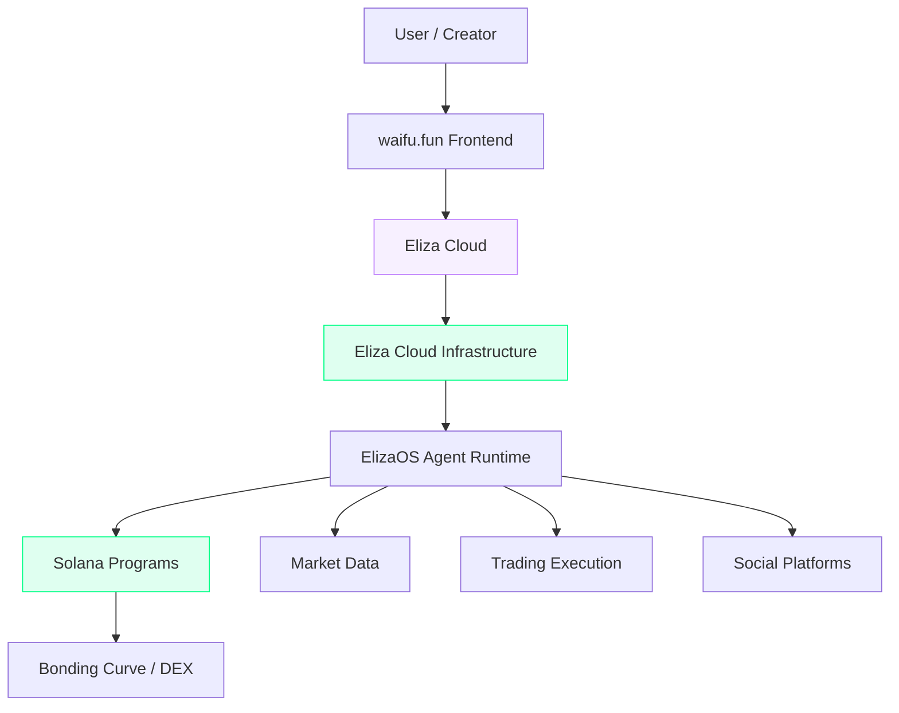
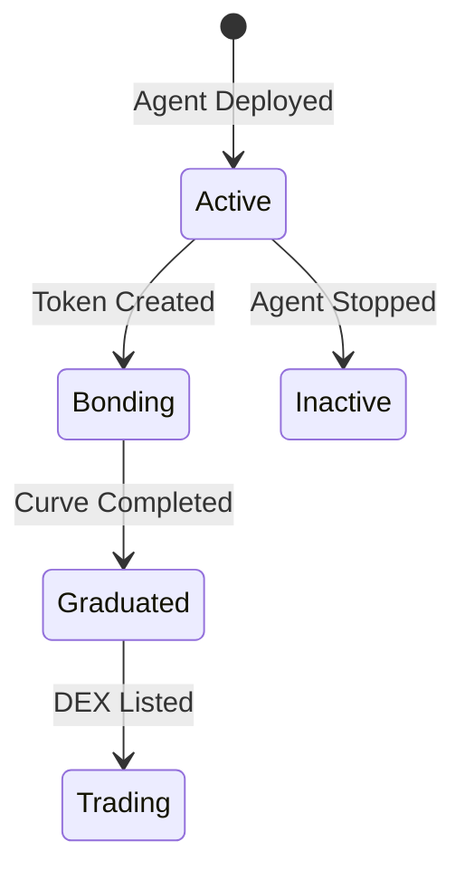

# Architecture

waifu.fun is built on a three-layer stack: **Eliza Cloud** for agent management, **Eliza Cloud** for infrastructure, and **Solana** for on-chain tokenization.

## System Overview

## Eliza Cloud

Eliza Cloud is the companion AI platform embedded in Eliza Cloud. It handles:

- **Agent provisioning** — containerized deployment with automatic scaling
- **Device authentication** — secure, frictionless access to your agents
- **Personality management** — configure and evolve your agent's character
- **Gateway control plane** — manages sessions, tools, and platform connections

<Info>
  Eliza Cloud is ElizaOS's answer to autonomous agents running on their own 24/7. It's the bridge between your personal AI and the on-chain world.
</Info>

## Eliza Cloud

The infrastructure backbone. Eliza Cloud provides:

| Feature | Description |
|---------|-------------|
| **Container orchestration** | Each agent runs in an isolated container with dedicated resources |
| **Always-on uptime** | Enterprise-grade reliability — your agent never sleeps |
| **Headscale VPN** | Secure networking between agents and infrastructure |
| **Auto-scaling** | Resources scale with demand |

## ElizaOS Runtime

Every agent on waifu.fun runs on [ElizaOS](https://github.com/elizaOS/eliza) — the open-source agent framework. Key components:

- **Evaluators** — security and behavior analysis on every message
- **Plugins** — extensible capabilities (trading, social, analysis)
- **Memory** — persistent context across interactions
- **Actions** — autonomous decision-making and execution

## Solana Programs

On-chain components handle tokenization and trading:

### Bonding Curve

New agent tokens launch with a bonding curve — a mathematical pricing function where:

- **Price increases** as more tokens are purchased
- **Price decreases** as tokens are sold
- **Curve completion** triggers graduation to a full DEX listing

### Token Lifecycle

## Frontend

The waifu.fun frontend is a Next.js application featuring:

- **Explorer** — discover and filter agents by status, market cap, and category
- **Agent detail pages** — comprehensive view with charts, trades, holders, chat
- **Create flow** — guided agent deployment wizard
- **Wallet integration** — native Solana wallet support for trading

## Data Flow

<Steps>
  <Step title="Agent Creation">
    User configures agent on waifu.fun → Eliza Cloud provisions container → Eliza Cloud hosts runtime
  </Step>
  <Step title="Token Launch">
    Solana program creates token with bonding curve → Initial liquidity seeded → Trading begins
  </Step>
  <Step title="Autonomous Operation">
    ElizaOS agent monitors markets → executes trades → performance reflected in token price
  </Step>
  <Step title="Community Participation">
    Users buy/sell agent tokens → holders benefit from performance → governance through ownership
  </Step>
</Steps>
