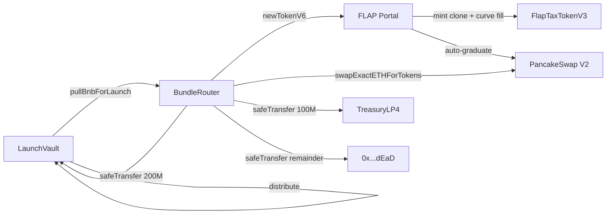

the bundle is the single transaction that turns a filled vault into a live
token with PCS liquidity and pro-rata distribution. understanding what it
does is the difference between trusting the platform and trusting a slogan.

## the contracts involved

## what happens inside executeBundle, in order

1. **set executed = true.** the router is one-shot. this flag flips before any
   third-party call to block reentry from a malicious token transfer hook.
2. **pull BNB from the vault.** the router calls
   `vault.pullBnbForLaunch(quoteAmt + v2BuyBnb)`. the vault transitions
   `OPEN/CLOSED` to `LAUNCHED` here, so even if downstream steps revert, the
   state is consistent.

   <Note>
     the current `BundleRouter` revokes any nonzero `tipBnb` with
     `TipNotAllowed()`. an explicit builder-tip funding model is reserved
     for a future revision but is not active today, so the vault pull is
     exactly `quoteAmt + v2BuyBnb`.
   </Note>

   <Note>
     a revert inside `executeBundle` rolls back the LAUNCHED transition. that
     is the whole point of atomicity. the vault state only "really" advances
     when the outer transaction commits.
   </Note>
3. **mint the token.** call `FlapPortal.newTokenV6{value: quoteAmt}(params)`.
   the portal deploys a `FlapTaxTokenV3` clone, fills the bonding curve, and
   if the curve crosses the four-fifths threshold (graduating tiers), auto-creates
   a PCS v2 pair seeded with 200M tokens and the curve BNB.
4. **validate predicted token.** the router checks the returned token address
   matches the `predictedToken` it stored at construction (CREATE2 with the
   creator's vanity salt). this guards against portal bugs.
5. **follow-up buy (if v2BuyBnb > 0).** call
   `pcsRouter.swapExactETHForTokensSupportingFeeOnTransferTokens` with
   fixed 2% slippage tolerance applied in-contract. this puts tokens into the router (post-tax
   because FLAP tokens are fee-on-transfer).
6. **split the token balance.** the router reads `totalY = balanceOf(this)`
   and `supply = totalSupply()`. it then computes FLAT amounts pegged to
   total supply:
   - `vault = supply / 5` (= 20% of supply = 200M tokens, for presalers)
   - `treasury = supply / 10` (= 10% of supply = 100M tokens, for TreasuryLP4)
   - `burn = totalY - vault - treasury` (= 50% of supply for tier 80; absorbs
     V2 follow-up buy tokens for graduating tiers, plus any rounding crumbs)
   the remaining 20% of supply lives in the FLAP-created PCS V2 LP at
   graduation (the 200M that flap migrates as initial liquidity).
7. **distribute the splits.** `safeTransfer` the vault share to `LaunchVault`,
   the treasury share to `TreasuryLP4`, the burn share to `0x...dEaD`. then
   call `vault.distribute(token, vaultAmt)` so claims can compute pro-rata,
   and `treasuryLp4.recordManagedToken(token)` to lock the launch token in
   the treasury contract.
8. **dust sweep.** any leftover BNB at the router goes to `0x...dEaD`. the
   router never holds custody between transactions.

<Note>
  builder-tipping (paying the 48 club EOA for puissant private-mempool
  inclusion) is handled out-of-band by the bundle bot's own EOA today,
  not by `BundleRouter`. the contract reserves a `tipBnb` parameter for a
  future on-chain tip flow but rejects nonzero values in the current
  version.
</Note>

## what is atomic

every step above is in a single transaction. if any one reverts, the entire
transaction reverts, and:

- vault BNB is preserved (no transfer ever cleared)
- no token was minted (or the mint was rolled back at the EVM level)
- no PCS pair exists (or the pair creation was rolled back)
- no presaler share was distributed
- the router's `executed` flag is rolled back to `false`, so the bot can retry

## what is not atomic

a few things are operationally trusted, not enforced on-chain:

- **the bundle bot must actually call executeBundle.** if the bot is down, the
  launch sits in `CLOSED` state. after three retries the bot calls
  `enableRefundBundleFailed()` and presalers refund. the bot is not the
  custodian, it is the operator.
- **the FLAP portal is third-party.** the contract validates the returned token
  address (predictedToken check) and relies on FLAP's own state. if FLAP is
  compromised at the protocol level, the bundle can fail or behave unexpectedly,
  but BNB inside our vault is still recoverable through refund.
- **PCS v2 prices.** the in-contract 2% slippage guard prevents catastrophic
  sandwich loss, but ordinary slippage within tolerance is accepted.

## the token split, in numbers

splits are FLAT against total supply (1B), so they're identical across tiers:

- 200M tokens (20% of supply) to `LaunchVault` for presaler claims, pro-rata
- 100M tokens (10% of supply) to `TreasuryLP4` for the V3 LP ladder
- 200M tokens (20% of supply) locked in the FLAP-created PCS V2 LP at graduation
- 500M tokens (50% of supply) burned (= router balance minus vault minus
  treasury; absorbs any V2 follow-up buy tokens for graduating tiers)

presalers receive their pro-rata share of 200M based on BNB deposited
relative to total deposits. exact amounts are emitted in the `BundleExecuted`
event so you can verify on-chain.

## after the bundle: post-graduation wiring

`executeBundle` ends with the FLAP-created V2 pair live and 100M tokens
sitting in `TreasuryLP4`. the treasury cannot run its oracle yet because
at bundle time the V2 pair address is not yet known to the contract.

that's solved by `LaunchFactory.finalizeLaunch(token)`, a separate
idempotent function that anyone can call once the V2 pair exists:

1. read the V2 pair from `pcsFactory.getPair(token, WBNB)` (must be non-zero)
2. call `treasuryLp4.setFlapV2Pair(pair)` to wire the TWAP oracle source
3. transfer ownership of the TreasuryLP4 from the factory to the agent's Safe
4. emit `LaunchFinalized`

after `finalizeLaunch`, the TreasuryLP4 is fully owned by the agent's Safe.
the `tier-cron` operator service can now permissionlessly call `oraclePoke()`
and `checkAndAdvance()` to deploy V3 LP tiers as the token's TWAP market cap
rises through the configured ladder.

## the predicted token check

each launch computes a CREATE2 address up front using the creator's vanity
salt and the FLAP TOKEN_TAXED_V3 implementation. the router stores this as
an immutable. if FLAP returns a different address from `newTokenV6`, the
bundle reverts. this is the strongest defense we have against portal misbehavior.

## why one-shot

`BundleRouter.executed` flips from `false` to `true` permanently at the start
of `executeBundle`. there is no path to flip it back. this means:

- a successful bundle cannot be replayed
- a malicious token transfer hook trying to reenter lands on `AlreadyExecuted`
- the router is a single-use contract by design
