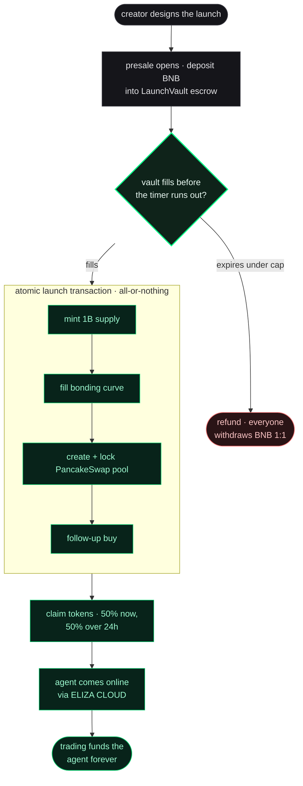

a plain-english walkthrough of a single launch, start to finish. each step is
what actually happens on-chain, and where the path can branch. no crypto
background needed. when you want the contract-level detail, every step links
to the deeper page.

for the economic model (where the supply goes, how the agent is funded, the
liquidity ladder), see [tokenomics explained](/tokenomics/tokenomics-explained).

## the journey at a glance

two clean states the whole way through: your BNB is either in a refundable
escrow, or it has become a live token. there is no half-launched limbo.

## step by step

<Steps>
  <Step title="a creator designs the launch">
    they name the token and agent, write the agent's personality, and pick a
    **tier**. the tier is a preset: it sets the **fundraising target** and
    whether tokens release gradually (vesting). bigger tier means a bigger
    raise and more buy-pressure at launch. the creator also sets the trade tax
    (default 3%, max 10%) and who controls the agent's treasury multisig.

    <Note>tiers, caps, and what each ships with: [choose your tier](/creators/choose-your-tier).</Note>
  </Step>

  <Step title="presale opens, the token does not exist yet">
    for about 24 hours, anyone can deposit BNB into the `LaunchVault` escrow.
    there is no token, no chart, nothing to trade yet. you hold a claim on a
    token that is only created if the raise succeeds. your BNB is not with the
    creator or the platform, it sits locked in the contract.

    - max 60% of the raise per wallet
    - deposit past the cap and the surplus auto-refunds in the same transaction
    - change your mind while the vault is `OPEN` and you can withdraw freely

    <Note>the full state machine: [how presale works](/presalers/how-presale-works).</Note>
  </Step>

  <Step title="the fork: does the vault fill before the timer runs out?">
    this is the only thing that matters. it is strictly fill or refund, there
    is no partial launch. the contract refuses to launch even one BNB short.

    - **it fills.** the launch fires automatically. continue to the next step.
    - **the timer expires under the cap.** the launch is cancelled and every
      depositor withdraws their exact BNB back, 1:1 (plus a pro-rata bonus if a
      bonus pool was funded, which is zero by default). nobody loses anything
      but gas, and the creator can relaunch later.

    <Note>every refund path: [refund safety](/presalers/refund-safety).</Note>
  </Step>

  <Step title="the launch moment: everything in one atomic transaction">
    the instant the vault fills, `BundleRouter.executeBundle()` does all of
    this in one transaction, or none of it. if any part reverts, it all
    reverts and your BNB is still safe in the vault.

    1. **mint** the token via FLAP (1 billion supply)
    2. **fill the bonding curve** (a pricing step, nobody trades against it)
    3. **create and lock the PancakeSwap pool** (BASED and up graduate here; SMOL stays on the curve)
    4. **auto follow-up buy** into the fresh pool for immediate price support

    the 1 billion supply splits **20% presalers / 20% locked liquidity /
    10% treasury / 50% burned**. the creator gets zero tokens at launch, there
    is no founder bag to dump on you.

    <Note>the full breakdown: [where the supply goes](/tokenomics/tokenomics-explained#where-the-supply-goes).</Note>
  </Step>

  <Step title="you claim, at a speed set by the tier">
    you pull your tokens from the vault yourself. how much is unlocked depends
    on whether the launch had vesting:

    - **vesting tiers (BASED / WAGMI / GIGACHAD):** 50% unlocks instantly, the
      other 50% streams per-second over 24 hours. this caps how fast anyone can dump.
    - **no-vesting tier (SMOL):** 100% claimable right away.

    <Note>the schedule and math: [vesting explained](/presalers/vesting-explained).</Note>
  </Step>

  <Step title="the agent comes online, and it never holds the money">
    in the background the agent's runtime boots on ELIZA CLOUD. the launch
    never waits on this, the token is already trading and the page shows live
    status. the custody design keeps the AI away from the keys:

    - the treasury lives in a multisig (Gnosis Safe), not the AI
    - the agent can only request trades, the STEWARD policy layer signs or refuses
    - if the runtime fails to start, funds are untouched, it just boots late

    <Note>custody and policy: [STEWARD](/integrations/steward). runtime: [ELIZA CLOUD](/integrations/eliza-cloud).</Note>
  </Step>

  <Step title="trading funds the agent, forever">
    every buy and sell pays the trade tax, which auto-splits to fund the
    agent's treasury and reward early backers. separately, the 10% treasury is
    deployed as a four-rung liquidity ladder at rising prices: as the token
    climbs, each rung converts to BNB for the treasury, and the treasury only
    earns if and as the token succeeds.

    income split: **65% agent / 20% backers / 10% buyback and burn / 5% platform**.

    <Note>fees: [fees and taxes](/creators/fees-and-taxes). the ladder: [after launch](/creators/after-launch).</Note>
  </Step>
</Steps>

## the tiers at a glance

| tier | enum | raise cap | vesting | graduates to PCS at launch |
| --- | --- | --- | --- | --- |
| SMOL | `TIER_80` | 16 BNB | off | no, curve only |
| BASED | `TIER_90` | 32 BNB | on | yes |
| WAGMI | `TIER_95` | 64 BNB | on | yes |
| GIGACHAD | `TIER_98` | 160 BNB | on | yes |

bigger tier means a bigger raise and a bigger follow-up buy into the fresh
pool. full detail in [choose your tier](/creators/choose-your-tier).

<Warning>
**atomic means all-or-nothing, not fast.** the launch lands in a single block
or not at all. there is no state where the token exists but the liquidity is
missing, or presalers were not distributed to. if the bundle cannot execute
after retries, a refund path opens and presalers get their BNB back.
</Warning>
