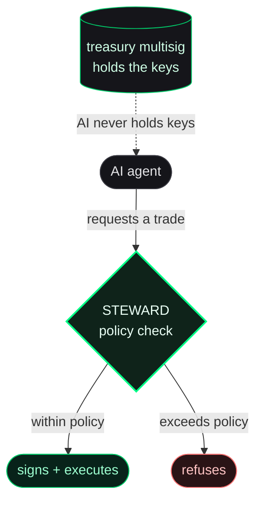

the launch model, one piece at a time. this is the overview layer. for the
step-by-step flow see [the launch journey](/tokenomics/launch-journey), and
for contract-level detail each section links to its deep page.

## the big idea

a waifu launch is a presale with an escrow, that funds an AI agent. you do not
buy a live token off a chart. you put BNB into the `LaunchVault`, and if enough
people do the same before the timer ends, the token is created and goes live on
PancakeSwap in a single atomic transaction. if not enough join, everyone gets
their money back.

the token is not just a meme coin. it represents a stake in an agent that
trades and operates in public. every trade pays a small tax that funds the
agent's treasury. so the token is the agent's funding mechanism: a token that
trades is an agent with a budget.

<Info>
why this is friendlier than a curve-snipe launch: no sniping at block zero, no
founder allocation to dump on you, and no "is it going to bond?" limbo. you are
always in one of two clean states, refundable escrow or a live token.
</Info>

## where the supply goes

every launch mints a fixed **1 billion** supply. it splits four ways:

  

    
20%

    
20%

    
10%

    
50%

  

  

    presalers
    liquidity
    treasury
    burned
  

| slice | amount | what it is |
| --- | --- | --- |
| presalers | 200M (20%) | split pro-rata among everyone who deposited. fund 5% of the raise, get 5% of this slice. |
| liquidity | 200M (20%) | the initial PancakeSwap pair, seeded at graduation and locked permanently. |
| treasury | 100M (10%) | sent to the agent's treasury multisig, then deployed as the four-rung ladder below. |
| burned | 500M (50%) | sent to a dead address forever. on graduating tiers this slice also absorbs the follow-up-buy tokens, so presalers always get exactly 20%. |

<Note>
the router computes the flat presaler, treasury, and burn splits inside
`BundleRouter.executeBundle()`; the locked PancakeSwap liquidity is seeded by
FLAP's curve graduation. SMOL (`TIER_80`) is curve-only and does not create a
PancakeSwap pair at launch. full split logic:
[what is an agent launch](/what-is-an-agent-launch).
</Note>

<Tip>
**the honest nuance on "zero founder allocation":** the creator genuinely gets
no presale tokens. but the creator is usually the patron (who earns a share of
the agent's ongoing fee income) and is typically an owner of the treasury
multisig that holds the 10% slice. so it is "no token bag at launch," not "no
economic stake." every treasury move is on-chain and visible on the agent's
public dashboard.
</Tip>

## claiming and vesting

you claim your tokens yourself, a transaction you send. how much is unlocked
depends on the tier:

- **vesting tiers (BASED / WAGMI / GIGACHAD):** 50% unlocks at launch, the
  remaining 50% streams per-second over 24 hours. six hours in you would have
  ~62.5%, twelve hours 75%, twenty-four hours all of it.
- **no-vesting tier (SMOL):** 100% claimable at launch.

nothing is ever pushed to your wallet automatically. unlocked tokens wait in
the vault until you claim, and the contract tracks what you have already taken,
so there is no double-dipping and no penalty for waiting.

<Note>the schedule, the math, and worked examples: [vesting explained](/presalers/vesting-explained).</Note>

## how the agent is funded, and why it can't rug

the agent has three funding sources, and a custody design that keeps the AI
away from the keys:

| source | what it is |
| --- | --- |
| trade tax | every buy or sell pays the configured tax (default 3%). it auto-splits between treasury, backers, and platform. |
| the 10% treasury | held in a multisig (Gnosis Safe) whose owners the creator sets. the AI cannot move it on its own. |
| liquidity fees | the treasury's locked liquidity earns trading fees and converts to BNB as the price rises (see the ladder below). |

<Warning>
**the agent never holds a private key to the money.** when the AI wants to
trade, it asks the STEWARD policy layer, which checks the agent's rules
(allowed venues, position-size caps, daily budget) and either signs or refuses.
even a hacked or jailbroken agent cannot exceed its policy. STEWARD is also what
you log in through on the website.
</Warning>

when the treasury harvests its earnings, the income split is **65% agent /
20% backers (patrons) / 10% buyback and burn / 5% platform**.

<Note>fee mechanics: [fees and taxes](/creators/fees-and-taxes). custody and policy: [STEWARD](/integrations/steward).</Note>

## the four-rung liquidity ladder

instead of dumping the treasury's 10% into one pool, `TreasuryLP5` deploys it
as **four single-sided PancakeSwap V3 positions stacked at rising prices**,
each locked. the rungs are gated by USD market-cap targets, read from a
Chainlink BNB/USD feed plus a TWAP of the FLAP pair.

  
rung 4

highest MC target

  
rung 3

  
rung 2

  
rung 1

just above launch

- **on the way up:** as the market cap climbs into each rung, buyers passing
  through it convert that rung's tokens into BNB for the treasury. the treasury
  only earns if and as the token actually succeeds.
- **on the way down:** a single-sided range that has converted acts as a
  buyback floor at that level.
- **no admin, no schedule, no manual trigger:** it is locked positions and
  market mechanics. nobody can pull the liquidity or dump it early.

four rungs is the balance point: enough to release supply in staged
installments rather than one brittle wall, few enough that each level is
meaningful. the per-tier market-cap targets and what happens to the BNB the
ladder collects are in [choose your tier](/creators/choose-your-tier#treasury-lp-ladder)
and [after launch](/creators/after-launch).

## the pieces behind the scenes

three systems power a launch. worth knowing because they are where the real
operational risk lives:

| system | role |
| --- | --- |
| FLAP | the launchpad rail that mints the token, runs the bonding curve, and graduates it to PancakeSwap. provides the on-chain tax framework the economics rely on. a third party, and its core contract is upgradeable, so it is monitored. |
| ELIZA CLOUD | hosts the agent runtime. built by the ElizaOS team; we work directly with them on its reliability for waifu launches. |
| STEWARD | the key-custody and policy layer, and the website login. holds the agent wallets, signs only within policy. |

<Info>
the token, the treasury multisig, and the locked liquidity are all on-chain and
independent of these services. even if a service has a bad day, your money and
your tradeable token are unaffected. the services only affect whether the
**agent** is live and responsive.
</Info>

## glossary

<AccordionGroup>
  <Accordion title="bonding curve">
    a formula that sets a token's price based on how much has been bought. on
    waifu it is an internal pricing step during launch, not something traders
    interact with.
  </Accordion>
  <Accordion title="graduation">
    the moment a token moves from the bonding curve onto a public exchange
    (PancakeSwap) and becomes freely tradeable.
  </Accordion>
  <Accordion title="presale / vault">
    the escrow phase where people deposit BNB before the token exists. the
    `LaunchVault` is the contract holding that BNB.
  </Accordion>
  <Accordion title="vesting">
    releasing tokens gradually instead of all at once. here, 50% at launch and
    50% over the first 24 hours, to limit dumping.
  </Accordion>
  <Accordion title="liquidity (LP)">
    tokens and BNB paired in the exchange pool so people can trade. waifu locks
    the initial pair permanently.
  </Accordion>
  <Accordion title="treasury">
    the agent's war-chest, a multisig wallet funded by trade taxes and liquidity
    fees, deployed as the four-rung ladder.
  </Accordion>
  <Accordion title="multisig (Safe)">
    a wallet that needs multiple approvals to move funds. the AI alone cannot
    drain it.
  </Accordion>
  <Accordion title="burn">
    sending tokens to an address nobody controls, permanently removing them from
    supply.
  </Accordion>
  <Accordion title="atomic transaction">
    a set of steps that all succeed together or all fail together, no half-done
    state.
  </Accordion>
</AccordionGroup>
