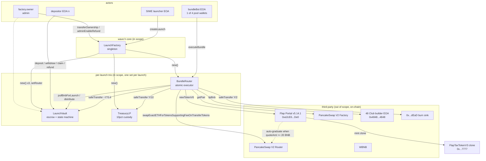
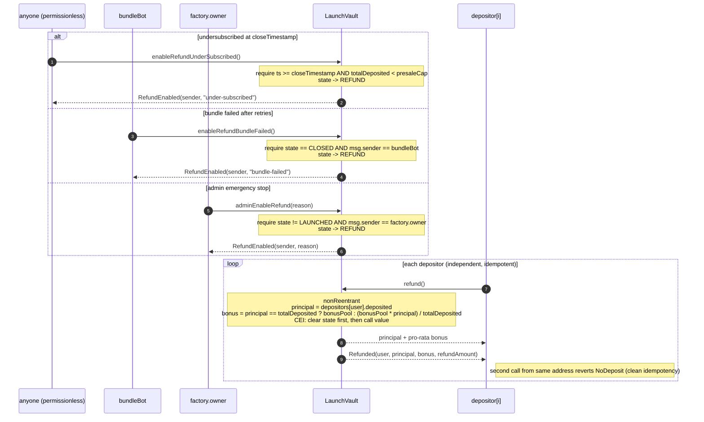

# wave h architecture

> companion to `THREAT_MODEL.md`, `EMPIRICAL_VALIDATION.md`, and `KNOWN_ISSUES.md`.
> source spec: `WAVE_H_FLAP_NATIVE_SPEC.md` (in upstream waifu.fun memory; not redistributed
> with the audit package by design, auditors should treat the on-chain contracts +
> this folder as authoritative).

## 1. one-paragraph summary

waifu.fun is a presale-escrow + atomic-bundle launchpad sitting on top of flap
portal v5.14.1 (`0xe2cE6ab80874Fa9Fa2aAE65D277Dd6B8e65C9De0` on BSC). users deposit
BNB into a per-launch `LaunchVault` during an open window. once the cap is met,
a per-launch `BundleRouter` runs a single atomic transaction that calls flap's
`newTokenV6` to mint a tax-token and (optionally) graduate it to pancakeswap v2,
optionally follow-up-buys from that v2 pool, and splits the resulting tokens
50/10/20 between a burn address, a `TreasuryLP` custody contract, and the
`LaunchVault` for pro-rata presaler distribution. atomic-or-bust: any revert
inside `executeBundle` rolls everything back and the vault BNB is preserved
for a refund.

## 2. contract topology



trust boundaries:

- the factory + per-launch trio are immutable once deployed. no proxy, no upgrade.
  `factory.owner` controls only `transferOwnership` and an admin-refund kill switch
  on individual vaults via `LaunchVault.adminEnableRefund`. owner cannot drain
  funds, mint tokens, or change tier math.
- the bundle bot EOA is operationally trusted: it can grief by never calling
  `executeBundle` (which forces a refund path) but cannot steal BNB. see
  `THREAT_MODEL.md` section 4.
- flap portal is treated as third-party untrusted infrastructure. our predictedToken
  check + the atomic-revert property are the two guards against portal misbehaviour.

## 3. happy-path sequence (tier 90/95/98, graduating tiers)

```mermaid
sequenceDiagram
  autonumber
  participant C as creator EOA
  participant F as LaunchFactory
  participant V as LaunchVault
  participant R as BundleRouter
  participant T as TreasuryLP
  participant Bot as bundleBot EOA
  participant D as depositor[i]
  participant P as Flap Portal v5.14.1
  participant Pcs as PancakeSwap V2
  participant Burn as 0x...dEaD
  participant Tip as 48 Club EOA

  C->>F: createLaunch(config)
  F->>V: new LaunchVault(...)
  F->>T: new TreasuryLP(creator, factory)
  F->>R: new BundleRouter(...)
  F->>V: setRouter(router)
  F-->>C: LaunchAddresses { vault, router, treasuryLp, predictedToken }

  loop OPEN window
    D->>V: deposit() (msg.value)
    V-->>D: Deposited(user, amount, newTotal)
  end

  D->>V: close() (anyone, after closeTimestamp OR cap reached)
  V-->>D: Closed(by, totalDeposited, bonusPool)

  Bot->>R: executeBundle(params)
  Note over R: executed = true (CEI; reentry-blocks)
  R->>V: pullBnbForLaunch(quoteAmt + v2BuyBnb + tipBnb)
  V->>R: BNB transfer
  V-->>D: LaunchExecuted(0, amount, ts)

  R->>P: newTokenV6{value: quoteAmt}(...)
  Note right of P: clone deploy, curve fill, auto-graduate at 20 BNB
  P->>Pcs: createPair + addLiquidity (200M token / curve BNB)
  P-->>R: token address (must == predictedToken)

  alt v2BuyBnb > 0
    R->>Pcs: swapExactETHForTokensSupportingFeeOnTransferTokens(minV2TokensOut, ...)
    Pcs-->>R: post-tax tokens
  end

  R->>R: totalY = balanceOf(this)<br/>burn = Y/2, treasury = Y/10, vault = Y - burn - treasury
  R->>Burn: safeTransfer(burn)
  R->>T: safeTransfer(treasury)
  R->>V: safeTransfer(vault)
  R->>V: distribute(token, vaultAmt)
  V-->>D: Distributed(token, vaultAmt)
  Note over V: state OPEN/CLOSED -> LAUNCHED inside pullBnbForLaunch (step earlier)

  R->>Tip: tipBnb (raw call)
  R->>Burn: dust sweep (any leftover BNB)
  R-->>Bot: BundleExecuted(token, pool, ...)

  loop after launch
    D->>V: claim()
    V->>V: _claimableOf(user) = _vestedOf - claimed
    V-->>D: safeTransfer token (50pct TGE + 50pct linear over 24h if vesting on)
  end
```

note for tier 80: `quoteAmt = 16 BNB` (curve only, no graduation). `v2BuyBnb = 0`.
`pair == address(0)` after `newTokenV6`. router skips the V2 follow-up buy and
emits `BundleExecuted` with `pool = address(0)` and `openMcBnb = 0`. presalers
get a flat 20% of total supply (200M tokens). the token sits in flap's `Tradable` status
until organic buyers push it past graduation (when one of them sends a buy that
crosses the four-fifths threshold, flap auto-graduates to v2).

## 4. refund paths

three triggers, one refund function, idempotent per address.



invariant: a vault that reaches `REFUND` cannot leave it. there is no transition
from `REFUND` back to `OPEN`/`CLOSED`/`LAUNCHED`. once any one of the three
triggers fires, presalers are guaranteed a withdrawal path with no token side.

## 5. state machines

`LaunchVault.state`:

```
                  pullBnbForLaunch (router)
   OPEN ---close---> CLOSED ---------------> LAUNCHED  (terminal happy)
     |                  |
     | enableRefund     | enableRefund
     | (undersubscribed | (bundle-failed
     |  or admin)       |  or admin)
     v                  v
                   REFUND  (terminal sad)
```

note: `OPEN -> LAUNCHED` is also possible if a cap-hit triggers
`pullBnbForLaunch` directly without an explicit `close()` (legal per the
contract's `pullBnbForLaunch` guard: `state in {OPEN, CLOSED}`). in practice
the bundle bot calls `close()` first to snapshot `totalDepositedAtLaunch`
and emit the close event, but this is a backend convention, not enforced
on chain. the math handles both via the `if (totalDepositedAtLaunch == 0)`
fallback inside `pullBnbForLaunch`.

`BundleRouter.executed`:

```
   false (constructor) ---executeBundle---> true (terminal)
```

one-shot. flipped to `true` before any third-party call (checks-effects-interactions).
re-entry from a malicious token's transfer hook lands on `AlreadyExecuted` revert.

`TreasuryLP.managedToken`:

```
   address(0) ---recordManagedToken(t)---> t (locked)
```

permissionless to set, locked to the first non-zero token. subsequent calls with
a different token revert `MultipleTokens`. router never calls this directly;
it just `safeTransfer`s to treasury and trusts a downstream LP-deployer wave
to call `recordManagedToken` + `sweep`.

## 6. token flow accounting

within a single successful `executeBundle` call (tier 90+):

- BNB in: `quoteAmt + v2BuyBnb + tipBnb` (pulled from vault to router)
- BNB out:
  - `quoteAmt` to portal (curve buy + graduation seed)
  - `v2BuyBnb` to PCS router (v2 follow-up buy)
  - `tipBnb` to 48 Club EOA
  - any dust to `0x...dEaD`
- BNB net at router: 0 (no persistent custody)
- token out: 100% of `IERC20(token).balanceOf(router)` distributed in same tx
  - **flat 20% of total supply (200M)** to `LaunchVault`
  - **flat 10% of total supply (100M)** to `TreasuryLP`
  - **everything else** to `0x...dEaD` (= 50% of supply for tier 80; absorbs the V2 follow-up buy tokens for graduating tiers so vault + treasury allocations are constant per spec)
- vault token holdings: presaler share, distributed pro-rata via `claim()`
- LP-side at PCS V2 pair (held by portal's migrator, locked LP):
  - tier 90: ~100M tokens / ~16 BNB
  - tier 95: ~50M tokens / ~16 BNB
  - tier 98: ~20M tokens / ~16 BNB

dynamic split: the router reads `IERC20(token).balanceOf(this)` AFTER the v2 buy
(or after portal call for tier 80) and computes splits from that. it does NOT
hardcode per-tier numbers. this is deliberate because `FlapTaxTokenV3` is
fee-on-transfer (the V2 buy returns post-tax tokens, even though the curve
buy is not taxed).

## 7. addresses + immutables

all bsc mainnet, chainId 56:

| name | address |
|------|---------|
| flap portal v5.14.1 | `0xe2cE6ab80874Fa9Fa2aAE65D277Dd6B8e65C9De0` |
| TOKEN_TAXED_V3 impl (CREATE2 base) | `0x024f18294970B5c76c0691b87f138A0317156422` |
| WBNB | `0xbb4CdB9CBd36B01bD1cBaEBF2De08d9173bc095c` |
| PCS V2 factory | `0xcA143Ce32Fe78f1f7019d7d551a6402fC5350c73` |
| PCS V2 router | `0x10ED43C718714eb63d5aA57B78B54704E256024E` |
| 48 Club builder EOA (tip receiver) | `0x4848489f0b2BEdd788c696e2D79b6b69D7484848` |
| dead burn sink | `0x000000000000000000000000000000000000dEaD` |

the `LaunchFactory` stores all of these as immutables in its constructor. each
`BundleRouter` re-stores the subset it needs (WBNB, PCS factory/router, portal,
tip receiver) as immutables from factory construction args.

## 8. third-party interfaces

minimal surfaces the wave H contracts touch:

```solidity
interface IFlapPortal {
    function newTokenV6(FlapTypes.NewTokenV6Params calldata params)
        third-party
        payable
        returns (address token);
}

interface IPancakeFactory {
    function getPair(address tokenA, address tokenB) third-party view returns (address pair);
}

interface IPancakeRouter02 {
    function swapExactETHForTokensSupportingFeeOnTransferTokens(
        uint256 amountOutMin,
        address[] calldata path,
        address to,
        uint256 deadline
    ) third-party payable;

    function getAmountsOut(uint256 amountIn, address[] calldata path)
        third-party view returns (uint256[] memory amounts);
}

interface IPancakePair {
    function getReserves() third-party view returns (uint112 r0, uint112 r1, uint32);
    function token0() third-party view returns (address);
    function token1() third-party view returns (address);
}

interface ILaunchVaultRouterCallbacks {
    function pullBnbForLaunch(uint256 amount) third-party;
    function distribute(address token, uint256 presalerShare) third-party;
}

interface ILaunchFactoryOwner {
    function owner() third-party view returns (address);
}

interface IVaultRouterSetter {
    function setRouter(address _router) third-party;
}
```

see `packages/contracts-evm/contracts/flap/IFlapPortal.sol` and `flap/FlapTypes.sol`
for the full `NewTokenV6Params` struct. all 26 fields are documented in
`EMPIRICAL_VALIDATION.md` section 2.
