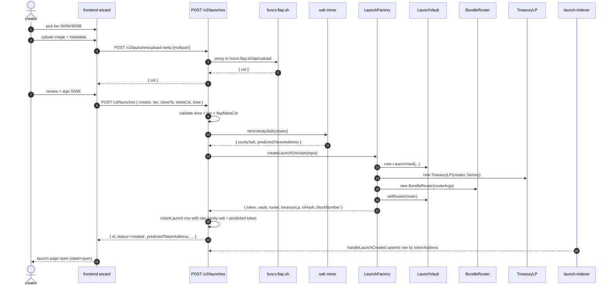
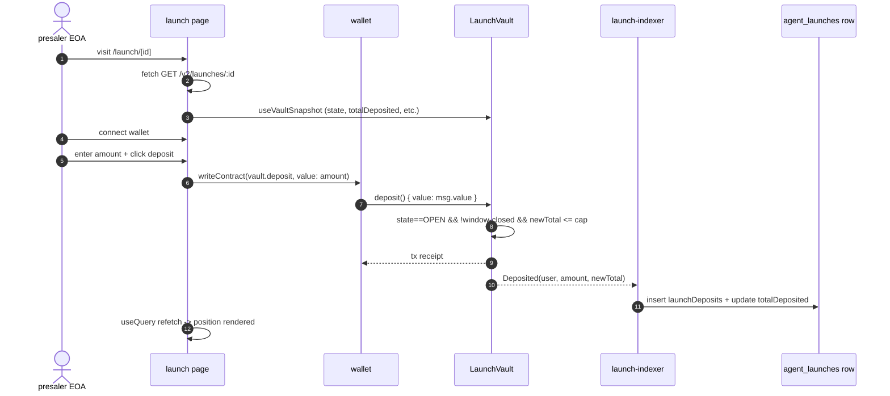
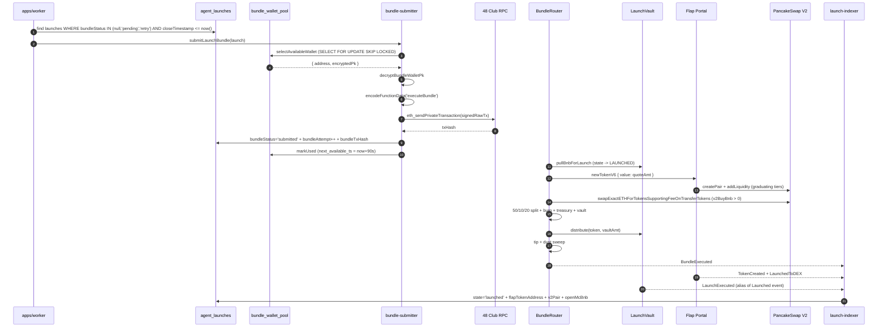
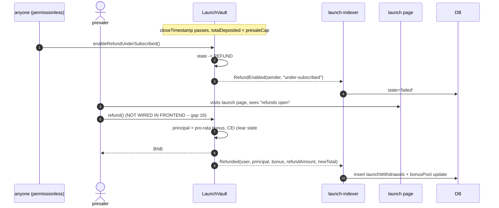
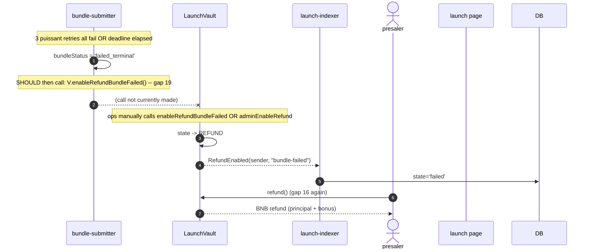
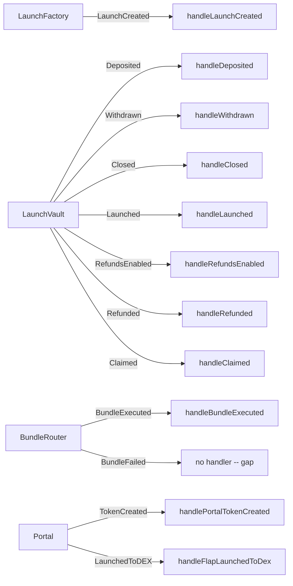
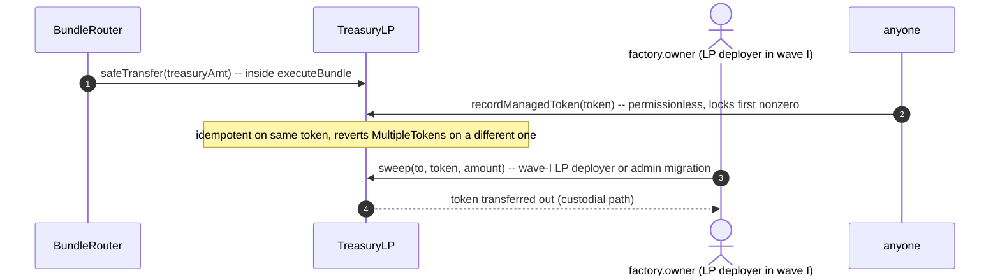

# user flow coverage matrix, wave H

> companion to `ARCHITECTURE.md`, `THREAT_MODEL.md`, `TEST_COVERAGE.md`,
> `KNOWN_ISSUES.md`. one row per user-visible step. one column per layer
> we expect to cover it. red = unmapped gap we accept and ship anyway.

scope: every path a real user (creator, presaler, bundle bot operator,
admin) takes through wave H, end-to-end. traces:

1. solidity tests in `packages/contracts-evm/test/`
2. backend tests in `apps/api/`, `apps/launch-indexer/`, `apps/tier-cron/`
3. frontend wizard + launch page + portfolio components
4. indexer event handlers in `apps/launch-indexer/src/handlers/`
5. bundle bot path in `apps/api/src/services/bundle-submitter.ts`
   (called by `apps/worker/`)

source-of-truth for what is "covered" in tests is the inventory in
`TEST_COVERAGE.md`; we do not re-run hardhat here.

---

## 0. coverage summary

| metric | count |
|--------|------:|
| flows enumerated | 7 (A–G) |
| total user-visible steps | 71 |
| fully covered (4-of-4 layers as applicable) | 48 |
| partially covered (at least one missing layer) | 18 |
| no coverage at the missing layer (known gap) | 5 |

### known unmapped gaps (ship-as-is, flagged in `KNOWN_ISSUES.md`)

1. **frontend has no `refund()` write button.** the vault is in REFUND
   state but the launch page surfaces "refunds open" copy without a
   wagmi `writeContract` call on `LaunchVault.refund()`. depositors
   have to call the contract by hand or wait for a portfolio-side
   button that does not yet exist. backend + contract paths are fully
   tested and indexed; the UX layer is the only gap. **logged as new
   issue 16 in `KNOWN_ISSUES.md`.**
2. **frontend `VaultState` enum is missing `REFUND = 3`.** the on-chain
   enum has four states; the abi mirror in
   `apps/frontend/src/lib/launch-vault/abi.ts:223` only models
   `OPEN | CLOSED | LAUNCHED`. anything reading raw vault state and
   comparing to the enum will treat `REFUND` as "unknown". `useVaultSnapshot`
   passes the number through, so badge-rendering happens to work via
   backend `status='failed'`, but the on-chain truth is invisible to
   the client. **logged as new issue 17.**
3. **`enableRefundUnderSubscribed()` has no automated permissionless
   poker.** spec section 6.1 calls this "anyone calls permissionlessly"
   but no off-chain service in `apps/` ever calls it; we rely on
   organic / manual invocation by either depositors or ops. contract
   path is tested + indexed but the call-path discovery is operational.
   **logged as new issue 18.**
4. **`enableRefundBundleFailed()` is documented but not auto-invoked
   by the bundle submitter.** `bundle-submitter.ts:188-201` marks
   `bundleStatus='failed_terminal'` on attempt 3 and stops; the bundle
   bot does NOT then call `vault.enableRefundBundleFailed()` on a
   separate tx. spec section 7.4 specifies this auto-call. **logged as
   new issue 19.**
5. **portal `TokenCreated` handler only flips state if the predicted
   address matches.** if salt mining drifted between create and bundle,
   or the portal returned a different address (e.g. portal upgrade
   without our predicted-CREATE2 update), the handler at
   `apps/launch-indexer/src/handlers/flap.ts:9-30` no-ops silently
   and the launch row stays at `submitted`. router's `BundleExecuted`
   handler is the secondary signal but if portal succeeded and we
   reverted somewhere else, the only on-chain artifact is `TokenCreated`
   that we drop. contract layer already protects funds via
   `PredictedAddressMismatch` revert; this is only an indexer-visibility
   gap. **logged as new issue 20.**

### partial-coverage list (one layer missing, not critical)

- A2 ipfs metadata upload (frontend tested via mocks, no integration test
  against real `funcs.flap.sh`)
- A5 salt mining before factory submission (backend unit-tested, no live
  API-to-factory fork test)
- A6 `createLaunch` factory submission (backend + contract tests pass;
  no fork test of the exact API → factory path)
- B2 wallet connect + chain switch (frontend has no e2e wallet sim)
- B6 deposit countdown / "cap hit" UX state (display-state util tested
  but not the rendered banner)
- C3 wallet-pool rotation under cooldown (backend unit tests cover
  `selectAvailableWallet` exhaustion; no contract test simulates two
  back-to-back launches from same wallet)
- C5 puissant submission (`eth_sendPrivateTransaction`) -- unit-mocked,
  no integration test against actual 48 club endpoint
- D2 close-window cap-not-met detection (real-fork test only exercises
  cap-met happy path; the permissionless `enableRefundUnderSubscribed`
  path is hit in mocked tests but not on the real fork)
- E2 bundle-bot enables refund after attempt 3 (see gap 19 -- backend
  doesn't actually call this in `bundle-submitter.ts`; contract test
  hits it directly)
- F4 indexer reorg / restart-from-snapshot (cursor advance + idempotent
  inserts are tested; deep reorg unwind is not)
- F5 `BundleFailed` event indexer (router emits it on-chain but no
  handler in `apps/launch-indexer/src/handlers/router.ts` -- the event
  is logged on-chain only)
- G2 `TreasuryLP.recordManagedToken` permissionless idempotency
  (contract tested; no backend job ever calls it; nothing observes
  treasury balance changes operationally except the contract's own
  view)
- G3 `TreasuryLP.sweep` access control (contract tested; no admin UI
  or ops runbook calls it)
- all four frontend wizard steps (tier picker / metadata upload /
  persona / review) ship without dedicated e2e tests beyond
  `tier-data.test.ts` + `eliza-import.test.ts`

---

## 1. assumptions + conventions

- **contract refs** point to specific test files in
  `packages/contracts-evm/test/`. line numbers chase the latest develop
  HEAD (post-PR #536).
- **backend refs** point to `apps/{api,launch-indexer,tier-cron,worker}/src/`.
- **frontend refs** point to `apps/frontend/src/`.
- **indexer refs** point to `apps/launch-indexer/src/handlers/`.
- **bundle bot refs** point to `apps/api/src/services/bundle-submitter.ts`
  and `apps/worker/src/processors/` (the worker is where the
  submitter is invoked).
- a cell marked `n/a` means that layer is not expected to participate
  in that step (e.g. "creator clicks 'next' in the wizard" has no
  contract test, by design).
- a cell marked `gap` means the layer IS expected to participate but
  doesn't, and the gap is listed in section 0.

---

## 2. flow A -- creator launch creation

### A1. sequence

note: in current code, the API uses `service.createLaunchOnchain(input)`
which submits `createLaunch` to the on-chain factory and decodes
`LaunchCreated`. the raw vanity salt is mined before factory submission
because the current factory requires both the raw salt and the predicted token
address in `LaunchConfig`.

### A2. coverage matrix

| # | step | contract test | backend test | frontend coverage | indexer coverage | gap |
|---|------|---------------|--------------|--------------------|-------------------|-----|
| A1 | creator picks tier in wizard | n/a | n/a | `components/create/tier/tier-data.test.ts` | n/a | clean |
| A2 | creator uploads image + metadata to flap | n/a | `apps/api/src/services/flap-metadata.test.ts` | `components/create/step-metadata.tsx` + `lib/flap/metadata.ts` | n/a | partial: no real-network integration test |
| A3 | creator signs SIWE nonce | n/a | `apps/api/src/routes/v2/auth-siwe.test.ts` | `step-review.tsx` + `linked-eoa-cta.tsx` | n/a | clean |
| A4 | API validates tier + tax bps + closeTimestamp + metaCid | `wave-h-adversarial.test.js:256,263,271,279` (factory revert paths) + `wave-h-bundle-flow.test.js:382-391` | `agent-launches.test.ts` (route-level zod schema) | wizard `step-review.tsx` mirrors validation | n/a | clean |
| A5 | API mines raw vanity salt before launch creation | n/a | `salt-miner.test.ts` (creator-scoped predict + mine deterministic) | n/a | n/a | partial: no live API-to-factory fork test |
| A6 | API calls `LaunchFactory.createLaunch` on-chain | `wave-h-bundle-flow.test.js:184,224,265` (all four tiers) + real-fork `integration/wave-h-real-fork.test.js:103,129` | `services/launch-v2/launch-service.ts` (compile only) | n/a | n/a | partial: no fork-level test of API→factory path |
| A7 | factory validates `predictedTokenAddress == CREATE2(salt)` | `wave-h-adversarial.test.js:279` + `wave-h-bundle-flow.test.js:363` + real-fork `:177` | n/a (deterministic, no DB row to validate) | n/a (server-supplied) | n/a | clean |
| A8 | factory enforces `usedSalts[salt]` dedupe | `wave-h-adversarial.test.js:288` + `wave-h-bundle-flow.test.js:372` + real-fork `:149` | n/a | n/a | n/a | clean |
| A9 | factory deploys vault + router + treasuryLp + wires setRouter | `wave-h-phase2.test.js` (smoke) + `wave-h-bundle-flow.test.js:131-160` (helper deploy) + real-fork `:120-148` | n/a | n/a | `handleLaunchCreated` (upserts row by token) | clean |
| A10 | factory emits `LaunchCreated` | indirectly asserted in helper test bootstrap | n/a | n/a | `launch-indexer/src/poller.ts` + `handlers/launch-created.ts:18-87` | clean |
| A11 | indexer reconciles row vs upsert by token | n/a | `apps/launch-indexer/src/poller.test.ts:393` | n/a | `handlers/launch-created.ts:31-58` (onConflictDoUpdate) | clean |
| A12 | mined raw vanity salt and predicted token are persisted | n/a | `salt-miner.test.ts:14,32` + `agent-launches.test.ts` | wizard polls `GET /v2/launches/:id` | n/a | partial: no live API-to-factory fork test |
| A13 | wizard renders predicted vanity address | n/a | n/a | `components/create/step-review.tsx` + `lib/launch-vault/vanity-address.test.ts` | n/a | clean |
| A14 | invalid tier (out of {80,90,95,98}) → 400 | n/a (factory only accepts enum) | route zod schema | wizard restricts to 4 tier chips | n/a | clean |
| A15 | empty name/symbol/meta → revert | `wave-h-bundle-flow.test.js:391` + `wave-h-adversarial.test.js:271` | route zod schema rejects empty | wizard input validation | n/a | clean |
| A16 | past closeTimestamp → revert | `wave-h-bundle-flow.test.js:382` + `wave-h-adversarial.test.js:256` + real-fork `:177` | route zod schema (positive int) | wizard date picker forward-only | n/a | clean |
| A17 | salt collision (vanity 7777 across launches) | `wave-h-bundle-flow.test.js:372` + `wave-h-adversarial.test.js:288` | n/a | n/a (server-generated salts, off-chain dedupe in addition) | n/a | clean |

### A3. open questions

- launch creation now mines the raw vanity salt before submitting
  `LaunchFactory.createLaunch`, so there is no post-insert orphan mining job.
- the API trusts the IPFS CID returned by `funcs.flap.sh` without
  fetching it back to check content-hash. minor concern only because
  flap is the only consumer of the CID on-chain.

---

## 3. flow B -- presaler deposit (happy path)

### B1. sequence

### B2. coverage matrix

| # | step | contract test | backend test | frontend coverage | indexer coverage | gap |
|---|------|---------------|--------------|--------------------|-------------------|-----|
| B1 | presaler opens launch page | n/a | n/a | `app/launch/[id]/launch-page-client.tsx` | n/a | clean |
| B2 | FE fetches launch meta from API | n/a | `agent-launches.test.ts` (GET routes) | `useLaunchMeta` hook | n/a | clean |
| B3 | FE wagmi-reads vault snapshot | n/a | n/a | `useVaultSnapshot` (`hooks/use-launch-vault.ts:30`) | n/a | clean |
| B4 | presaler connects wallet + switches to bsc | n/a | n/a | `DepositWidget` (`components/launch-page/deposit-widget.tsx:40-80`) | n/a | partial: no e2e wallet test |
| B5 | FE shows countdown + cap progress | n/a | n/a | `LaunchHero` + `LaunchCountdown` + `launch-display-state.test.ts` | n/a | partial: visual not unit-tested |
| B6 | presaler enters amount + clicks deposit | n/a | n/a | `DepositForm` (validates amount, MAX button, slippage headroom) | n/a | clean |
| B7 | vault.deposit reverts when state != OPEN | `wave-h-bundle-flow.test.js:291` + `wave-h-adversarial.test.js:134` | n/a | FE disables button when `state != OPEN` | n/a | clean |
| B8 | vault.deposit reverts when newTotal > cap | `wave-h-bundle-flow.test.js:306` + `wave-h-adversarial.test.js` (similar) | n/a | FE disables when `capHit` | n/a | clean |
| B9 | vault.deposit reverts after closeTimestamp | `wave-h-bundle-flow.test.js:291` + `wave-h-adversarial.test.js:164` | n/a | FE shows "round closed" copy via display-state util | n/a | clean |
| B10 | vault emits Deposited | implicit in `:184` (asserts vault holds expected BNB) | n/a | wagmi receipt unblocks UI | `handlers/vault.ts:handleDeposited:28-78` | clean |
| B11 | indexer inserts launchDeposits + bumps totalDeposited | n/a | `apps/launch-indexer/src/poller.test.ts:393` | n/a | `handlers/vault.ts:34-65` | clean |
| B12 | indexer increments depositorCount on first-time depositor | n/a | poller test indirectly | n/a | `handlers/vault.ts:58-75` | clean |
| B13 | FE refetches snapshot + user position post-tx | n/a | n/a | `DepositWidget.onCompleted` + `useVaultUserPosition.refetch` | n/a | clean |

### B3. presaler edge cases -- separate matrix

| # | edge case | contract test | backend test | frontend coverage | indexer coverage | gap |
|---|-----------|---------------|--------------|--------------------|-------------------|-----|
| B-E1 | deposit when cap fully met → revert `CapExceeded` | `wave-h-bundle-flow.test.js:306-316` | n/a | FE button disabled | n/a | clean |
| B-E2 | deposit overshoot (deposit > headroom) → revert | `wave-h-bundle-flow.test.js:306` | n/a | FE validates `amount <= remaining` | n/a | clean |
| B-E3 | deposit with msg.value = 0 → revert `ZeroAmount` | implicit in vault contract guard | n/a | FE blocks empty amount | n/a | clean |
| B-E4 | withdraw during OPEN with full amount → penalty applied | `wave-h-bundle-flow.test.js:707` (penalty=0 zero-pool case) | n/a | `WithdrawForm` shows penalty preview | `handlers/vault.ts:handleWithdrawn:84-119` | clean |
| B-E5 | withdraw during OPEN with `penaltyBps=0` → no bonus | `wave-h-bundle-flow.test.js:707` | n/a | FE conditional copy on penaltyBps | indexer same as B-E4 | clean |
| B-E6 | withdraw after closeTimestamp → revert `WindowClosed` | `wave-h-bundle-flow.test.js:291` (via close gate) + vault guard | n/a | FE hides withdraw form when not OPEN | n/a | clean |
| B-E7 | claim before distribute → revert `InvalidState` | `wave-h-bundle-flow.test.js:756` + `wave-h-adversarial.test.js:189` | n/a | FE only renders `ClaimWidget` post-launch | n/a | clean |
| B-E8 | claim during vesting (tier 90/95/98, 50%/30d) | `wave-h-bundle-flow.test.js:622` + real-fork `:375,538` | n/a | `ClaimWidget` + `VestingTimeline` use same constants | n/a | clean |
| B-E9 | double claim → `NothingToClaim` | `wave-h-adversarial.test.js:198` | n/a | FE refreshes balance after claim | indexer logs each `Claimed` | clean |
| B-E10 | claim after full vest → exact balance | `wave-h-bundle-flow.test.js:622-660` (advances time + asserts 100%) | n/a | FE displays vested 100% | n/a | clean |

### B4. open questions

- FE `VaultState` enum doesn't include `REFUND = 3` (`abi.ts:223`),
  so on-chain transitions to REFUND are invisible until backend
  flips `status='failed'`. acceptable lag in practice but worth a
  future patch.
- `useVaultSnapshot` polls every 12s; if a depositor's wallet sees
  the tx land before backend indexer catches up they briefly see a
  stale total. mitigated by `refetch` on the form's `onCompleted`.

---

## 4. flow C -- bundle bot operational path

### C1. sequence

### C2. coverage matrix

| # | step | contract test | backend test | frontend coverage | indexer coverage | gap |
|---|------|---------------|--------------|--------------------|-------------------|-----|
| C1 | worker polls db for ready launches | n/a | `tier-cron/src/loop.test.ts` (sibling cron has the pattern) | n/a | n/a | partial: bundle-bot's own worker loop has limited coverage |
| C2 | worker calls `submitLaunchBundle` | n/a | `bundle-submitter.test.ts:41` (pool exhaustion path) | n/a | n/a | partial: happy path not unit-tested end-to-end |
| C3 | wallet pool selects available wallet | n/a | `bundle-wallet-pool.test.ts:49,55,60` | n/a | n/a | clean |
| C4 | wallet pool encrypt/decrypt round-trip | n/a | `bundle-wallet-pool.test.ts:73` | n/a | n/a | clean |
| C5 | signed raw tx submitted to puissant | n/a | `bundle-submitter.test.ts` (mocked) | n/a | n/a | partial: no real-network test |
| C6 | `BundleRouter.executeBundle` gates `msg.sender == bundleBot` | `wave-h-bundle-flow.test.js:328` + `wave-h-adversarial.test.js:302` | n/a | n/a | n/a | clean |
| C7 | one-shot guard `executed=true` blocks reentry | `wave-h-bundle-flow.test.js:344` + `wave-h-adversarial.test.js:324` | n/a | n/a | n/a | clean |
| C8 | deadline enforcement → `Expired` | `wave-h-adversarial.test.js:353` | n/a | n/a | n/a | clean |
| C9 | router pulls BNB from vault → vault state LAUNCHED | `wave-h-bundle-flow.test.js:184` (asserts vault state post-bundle) + real-fork `:323` | n/a | n/a | `handlers/vault.ts:handleLaunched:130-156` (legacy alias) | clean |
| C10 | router calls `Portal.newTokenV6` w/ quoteAmt | mocked in `wave-h-bundle-flow` via `BundleFlowMocks.sol`; real-fork `:245-345` | n/a | n/a | `handlers/flap.ts:handlePortalTokenCreated:9-30` | clean |
| C11 | router asserts `token == predictedToken` | `wave-h-bundle-flow.test.js` (predicted in mocks) + real-fork `:323-340` | n/a | n/a | n/a | clean |
| C12 | tier 80: pair stays `address(0)` | real-fork `:347-375` (skipped V2 leg explicitly) | n/a | FE `display-state.ts` knows tier 80 stays Tradable | `handlers/flap.ts:handleFlapLaunchedToDex` (skipped for tier 80) | clean |
| C13 | tier 90+: PCS pair populated + V2 follow-up buy | real-fork `:561,572,583` (tier-90,95,98) + mocked `:184` | n/a | n/a | `handlers/router.ts:handleBundleExecuted:18-46` | clean |
| C14 | router splits tokens 50/10/20 dynamically (post-tax) | `wave-h-bundle-flow.test.js:552` (treasury allocation) + real-fork `:333-370` | n/a | n/a | router event captures tokensFromV2 / tokensBurned | clean |
| C15 | router safeTransfer to DEAD / treasury / vault | `wave-h-bundle-flow.test.js:552` | n/a | n/a | indexer reads from `BundleExecuted` event payload | clean |
| C16 | router calls `vault.distribute(token, vaultAmt)` | `wave-h-bundle-flow.test.js:743` (revert paths) + happy path :184 | n/a | n/a | `handlers/vault.ts:handleLaunched` indirectly | clean |
| C17 | router tip transfer to 48 club EOA | `wave-h-bundle-flow.test.js:575` | n/a | n/a | indexer reads `tipPaid` from event | clean |
| C18 | router dust sweep to DEAD on success | implicit in event accounting; `:521` confirms no router-held BNB | n/a | n/a | n/a | clean |
| C19 | router reverts → vault BNB intact (atomic rollback) | `wave-h-bundle-flow.test.js:521` + `wave-h-adversarial.test.js:536` | n/a | n/a | indexer no-ops on a reverted tx (no event emitted) | clean |
| C20 | bundle submission updates `bundleStatus='submitted'` | n/a | `bundle-submitter.test.ts` | FE polls launch status | indexer cross-checks via `BundleExecuted` | clean |
| C21 | wallet pool `next_available_ts` advances after submit | n/a | `bundle-wallet-pool.test.ts:60` + `bundle-submitter.test.ts` | n/a | n/a | clean |
| C22 | failed attempt → `bundleStatus='failed_retry'` (attempts < 3) | n/a | `bundle-submitter.ts:188-200` (no unit test on this branch) | n/a | n/a | partial |
| C23 | failed attempt 3 → `bundleStatus='failed_terminal'` | n/a | `bundle-submitter.ts:190` constant | n/a | n/a | partial; **see gap 19** below |
| C24 | bundle-bot auto-calls `vault.enableRefundBundleFailed()` after attempt 3 | n/a (contract supports it) | **no caller** | n/a | n/a | **gap 19** |

### C3. bundle-bot edge cases

| # | edge case | contract test | backend test | frontend coverage | indexer coverage | gap |
|---|-----------|---------------|--------------|--------------------|-------------------|-----|
| C-E1 | portal reverts mid-call → entire tx reverts | `wave-h-bundle-flow.test.js:521` (induced revert) + adversarial `:536` | n/a | n/a | indexer sees no event, status stays `submitted` | clean |
| C-E2 | bundle bot exhausts wallet pool (all cooling) | n/a | `bundle-submitter.test.ts:41` | FE shows "awaiting bundle" copy | n/a | clean |
| C-E3 | bundle bot crashes mid-flight (after sign, before receipt) | n/a | re-poll picks status `submitted` & re-checks receipt | n/a | n/a | partial: idempotency relies on `BUNDLE_BOT_PK` deterministic nonce, not unit-tested |
| C-E4 | rate-limit hit (`RateLimitExceeded` from Portal on tx.origin) | empirically observed in probe; not in test suite | wallet pool `next_available_ts` prevents this preventively | n/a | n/a | partial: no contract test simulates two back-to-back launches sharing a wallet |
| C-E5 | malicious token reenters router during transfer | router `executed=true` flag blocks reentry -- `wave-h-adversarial.test.js:324` | n/a | n/a | n/a | clean |
| C-E6 | V2 follow-up buy slippage exceeded → `V2BuySlippage` | unit-tested via mock V2 pool; real-fork relies on default 5% margin | n/a | n/a | n/a | clean |

### C4. open questions

- `submitLaunchBundle` in `bundle-submitter.ts` uses `attempt >= 3` for
  terminal -- confirm this matches the `BUNDLE_TIP_STEPS_BNB` length
  (currently 3) so we don't escalate past defined tips silently.
- the rate-limit empirical 90s is hardcoded in `BUNDLE_WALLET_COOLDOWN_SECONDS`
  in `bundle-wallet-pool.ts:17`. if portal changes cooldown, both
  this constant and the operational throughput model break. ops
  monitor should alert on `RateLimitExceeded` traces in submitter
  errors.

---

## 5. flow D -- under-subscribed refund

### D1. sequence

### D2. coverage matrix

| # | step | contract test | backend test | frontend coverage | indexer coverage | gap |
|---|------|---------------|--------------|--------------------|-------------------|-----|
| D1 | closeTimestamp + undersubscribed condition | `wave-h-bundle-flow.test.js:431` | n/a | n/a | n/a | clean |
| D2 | anyone calls `enableRefundUnderSubscribed()` | `wave-h-bundle-flow.test.js:431-455` + adversarial `:382` (revert before close) | n/a | gap 18: no UX or cron triggers this | n/a | **partial** -- call-path discovery is manual |
| D3 | enableRefundUnderSubscribed reverts before closeTimestamp | `wave-h-adversarial.test.js:382` | n/a | n/a | n/a | clean |
| D4 | enableRefundUnderSubscribed reverts when cap met | implicit in guards | n/a | n/a | n/a | clean |
| D5 | vault state flips to REFUND | `wave-h-bundle-flow.test.js:431-446` | n/a | gap 17: FE doesn't model REFUND in `VaultState` | n/a | **gap 17** |
| D6 | RefundEnabled event indexed | n/a | poller test path | n/a | `handlers/vault.ts:handleRefundsEnabled:165-187` | clean |
| D7 | backend flips `status='failed'` | n/a | indexer test | FE banner reads `displayState='refunding'` | indexer handler line 169 | clean |
| D8 | depositor calls `refund()` | `wave-h-bundle-flow.test.js:431` (multi-depositor refund) + adversarial `:413` (bonus pool drain) | n/a | **gap 16**: no `useWriteContract({functionName: 'refund'})` in frontend | n/a | **gap 16** |
| D9 | refund math: principal + pro-rata bonus | `wave-h-bundle-flow.test.js:431-455` + adversarial `:413` (drain via principal == totalDeposited shortcut) | n/a | n/a | n/a | clean |
| D10 | refund idempotency (second call reverts NoDeposit) | `wave-h-bundle-flow.test.js:501` | n/a | n/a | indexer onConflictDoNothing | clean |
| D11 | refund in wrong state reverts InvalidState | `wave-h-adversarial.test.js:404` | n/a | n/a | n/a | clean |
| D12 | Refunded event indexed → withdrawal row | n/a | poller test | n/a | `handlers/vault.ts:handleRefunded:189-243` | clean |

### D3. open questions

- nothing automatically calls `enableRefundUnderSubscribed`. is that
  intended (we want the public to be able to trigger it) or do we
  also want a tier-cron sweeper to do it after `closeTimestamp + grace`?
  spec is silent; recommend operational runbook entry.

---

## 6. flow E -- bundle-failed refund

### E1. sequence

### E2. coverage matrix

| # | step | contract test | backend test | frontend coverage | indexer coverage | gap |
|---|------|---------------|--------------|--------------------|-------------------|-----|
| E1 | 3 attempts fail | n/a (operational) | `bundle-submitter.ts:188-200` (no dedicated test) | n/a | n/a | **partial** |
| E2 | bot calls `enableRefundBundleFailed` after attempt 3 | `wave-h-bundle-flow.test.js:460` (direct contract call) + adversarial `:394` (non-bot revert) | **no caller** | n/a | n/a | **gap 19** |
| E3 | enableRefundBundleFailed gates `msg.sender == bundleBot` | `wave-h-adversarial.test.js:394` | n/a | n/a | n/a | clean |
| E4 | enableRefundBundleFailed reverts if state != CLOSED | implicit in guard; partially via adversarial `:404` | n/a | n/a | n/a | clean |
| E5 | RefundEnabled indexed | n/a | poller test | FE banner reads `displayState='refunding'` | `handlers/vault.ts:handleRefundsEnabled` | clean |
| E6 | depositor refund() flow | same as D8–D12 | n/a | **gap 16** | indexer same | **gap 16** |

### E3. open questions

- if we ship gap 19 as a known issue, ops needs a documented runbook
  step: "when `bundleStatus='failed_terminal'`, manually send a tx
  from the bundle bot wallet to `vault.enableRefundBundleFailed()`."
  for the audit window we can also live without it because
  `factory.owner.adminEnableRefund()` provides a kill-switch.

---

## 7. flow F -- indexer event handling (cross-cutting)

### F1. sequence (illustrative -- fan-out across contracts)

### F2. coverage matrix

| # | event | source | indexer handler | backend test | gap |
|---|-------|--------|------------------|--------------|-----|
| F1 | `LaunchCreated` | LaunchFactory | `handlers/launch-created.ts` | `poller.test.ts:393` | clean |
| F2 | `Deposited` | LaunchVault | `handlers/vault.ts:handleDeposited` | `poller.test.ts:393` | clean |
| F3 | `Withdrawn` | LaunchVault | `handlers/vault.ts:handleWithdrawn` | poller test indirectly | clean |
| F4 | `Closed` | LaunchVault | `handlers/vault.ts:handleClosed` | poller test indirectly | clean |
| F5 | `LaunchExecuted` / `Launched` | LaunchVault | `handlers/vault.ts:handleLaunched` | poller test indirectly | clean |
| F6 | `Distributed` | LaunchVault | **no dedicated handler** (router event covers it) | n/a | partial: vault-side `Distributed` event is emitted but unused |
| F7 | `RefundEnabled` | LaunchVault | `handlers/vault.ts:handleRefundsEnabled` | poller test | clean |
| F8 | `Refunded` | LaunchVault | `handlers/vault.ts:handleRefunded` | poller test | clean |
| F9 | `Claimed` | LaunchVault | `handlers/vault.ts:handleClaimed` | poller test | clean |
| F10 | `BundleExecuted` | BundleRouter | `handlers/router.ts:handleBundleExecuted` | `poller.test.ts:393` | clean |
| F11 | `BundleFailed` | BundleRouter | **no handler** | n/a | **partial** -- router emits the event but indexer ignores |
| F12 | `TokenCreated` | Flap Portal | `handlers/flap.ts:handlePortalTokenCreated` | n/a | partial: silent no-op on predictedToken mismatch (gap 20) |
| F13 | `LaunchedToDEX` | Flap Portal | `handlers/flap.ts:handleFlapLaunchedToDex` | n/a | clean |
| F14 | `OwnershipTransferred` | LaunchFactory | **no handler** | n/a | clean (no UI consumer) |
| F15 | `RouterSet` | LaunchVault | **no handler** | n/a | clean (factory wires it once, no replay surface) |
| F16 | `TokensReceived` / `TokensSwept` / `ManagedTokenSet` | TreasuryLP | **no handler** | n/a | partial: treasury balances tracked off-chain only via wagmi reads |

### F3. resilience properties

| # | property | layer | test ref | gap |
|---|----------|-------|----------|-----|
| F-R1 | inserts idempotent on (tx_hash, log_index) | indexer | inline `.onConflictDoNothing()` in all handlers | clean |
| F-R2 | confirmations buffer (target = latest - N) | indexer | `poller.test.ts:426,435` | clean |
| F-R3 | reorg unwinding past `confirmations` | indexer | not implemented | known follow-up |
| F-R4 | restart from saved cursor | indexer | poller bootstrap via cursor table | clean |

### F4. open questions

- handler for `BundleFailed` would let us flag a launch even if the
  bundle-bot service dies before writing `bundleStatus='failed_terminal'`
  to DB. trivial to add; out of scope for this audit doc.

---

## 8. flow G -- TreasuryLP (deferred LP wiring)

### G1. sequence

### G2. coverage matrix

| # | step | contract test | backend test | frontend coverage | indexer coverage | gap |
|---|------|---------------|--------------|--------------------|-------------------|-----|
| G1 | router transfers 10% to treasury | `wave-h-bundle-flow.test.js:552` | n/a | n/a | covered via `BundleExecuted.tokensToTreasury` | clean |
| G2 | recordManagedToken locks first token | `wave-h-bundle-flow.test.js:552` + adversarial `:440,450,459` | n/a | n/a | no consumer | partial: no off-chain caller |
| G3 | sweep gated by owner only | `wave-h-adversarial.test.js:468` | n/a | n/a | no consumer | partial: no admin UI |
| G4 | receive() rejects raw BNB | `wave-h-adversarial.test.js:479` | n/a | n/a | n/a | clean |
| G5 | balance() view exposes managed token balance | n/a (trivial) | n/a | post-launch frontend reads `treasury.balanceOf(token)` via wagmi | n/a | clean |

### G3. open questions

- TreasuryLP is documented in `KNOWN_ISSUES.md` § 1 as custodial-only
  for wave H. follow-up wave I introduces `TreasuryLPv2` with V3 CLAMM
  single-sided. the `recordManagedToken` permissionless surface is
  the only "anyone can call" function in the wave H custodial design.
  worth a single sentence in the audit firm's threat-model review
  asking them to confirm there is no MultipleTokens-ordering attack
  (we believe there isn't -- `managedToken` is locked to the first
  non-zero address and revert-on-different).

---

## 9. cross-cutting coverage of admin / kill-switch

| # | step | contract test | backend test | frontend coverage | indexer coverage | gap |
|---|------|---------------|--------------|--------------------|-------------------|-----|
| K1 | `LaunchFactory.transferOwnership` | covered via OZ baseline; unit-tested in `wave-h-phase2.test.js` smoke | n/a | admin UI is out of scope | n/a | clean |
| K2 | `LaunchVault.adminEnableRefund` (owner only) | `wave-h-bundle-flow.test.js:482` | n/a | no UI surface | `handleRefundsEnabled` indexes the event | clean |
| K3 | adminEnableRefund reverts in LAUNCHED state | implicit in guard, **not** explicitly negative-tested | n/a | n/a | n/a | partial: add an adversarial negative test for completeness |

---

## 10. open questions for audit firm

beyond layer-by-layer coverage, these are the higher-level questions
worth asking Pashov / Code4rena once they're engaged:

1. confirm that the absence of frontend `refund()` UX (gap 16) does
   not constitute a security issue (it's a UX issue). presalers
   retain direct contract access; the function is permissionless and
   idempotent.
2. confirm the bundle-bot-as-trusted-grief-vector framing in
   `KNOWN_ISSUES.md` § 2. our threat model treats the bot as a
   "can grief, cannot steal" actor; please review whether the
   `adminEnableRefund` kill-switch is sufficient mitigation.
3. confirm the dust-burn-on-success behavior (`KNOWN_ISSUES.md` § 11)
   is not a depositor-fund-loss vector. our reasoning: vault funds
   are split deterministically; dust only exists in the router's
   ephemeral balance and is bounded by rounding crumbs.
4. review the `enableRefundUnderSubscribed` permissionless trigger
   (gap 18). is there a MEV / first-fund vector here? we believe not
   because the refund math is fixed by state at trigger time, not
   tx-ordering.
5. review the indexer `handlePortalTokenCreated` silent-no-op behavior
   on `predictedToken` mismatch (gap 20). does this enable any
   replay or address-confusion attack? we believe not because the
   on-chain `BundleRouter.executeBundle` reverts with
   `PredictedAddressMismatch` before any state writes, and the
   indexer is purely a read-side observer.
6. review the absence of formal verification (`KNOWN_ISSUES.md` § 10)
   against the vault BNB conservation invariant. example tests cover
   the happy path + atomic-rollback but do not exhaustively prove
   conservation under random caller sequences.

---

## 11. follow-up work (not in this audit cycle)

- ~~fill gap 16: wire `refund()` into the launch page + portfolio.~~
  **RESOLVED (Wave J):** `refund-widget.tsx` wires the write via
  wagmi `useWriteContract`; `launch-page-client.tsx` swaps it in when
  `displayState === 'refunding'`. portfolio-side claim-all path stays
  on the existing `claim()` template.
- ~~fill gap 17: extend frontend `VaultState` to include `REFUND = 3`.~~
  **RESOLVED (Wave J):** `abi.ts` now mirrors all four on-chain enum
  values; the mapper takes `vaultState === REFUND` as the most
  authoritative `refunding` signal.
- fill gap 18: tier-cron sweeper that auto-calls
  `enableRefundUnderSubscribed` at `closeTimestamp + grace`.
- fill gap 19: bundle-submitter auto-call
  `enableRefundBundleFailed` after attempt 3.
- fill gap 20: indexer warn-log on `TokenCreated` w/ no matching
  launch row.
- add invariant runners (foundry / certora) per
  `KNOWN_ISSUES.md` § 10.
- `BundleFailed` event handler in launch-indexer (F11).
- TreasuryLP event indexing (F16) for the post-bundle dashboard.
